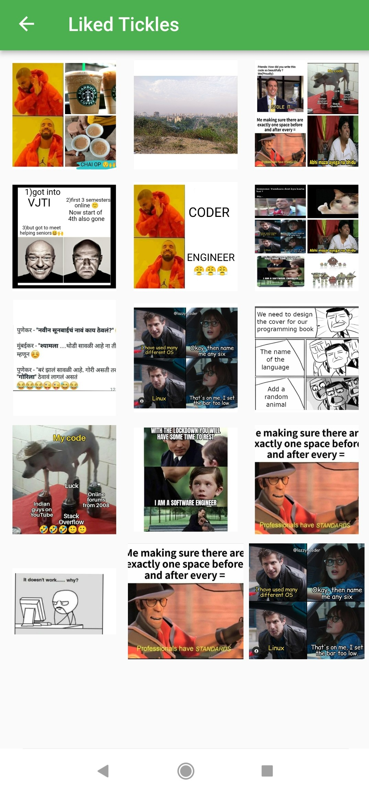
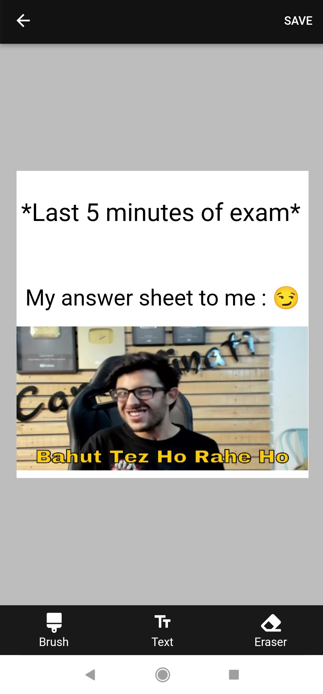

# Tickles
#### _An application to edit images and post them on the application itself or share them on other apps(WhatsApp, Facebook, Instagram, etc) with your family, friends or others._

## We have a special term for images edited and/or posted on our app!

## We call them  _tickles_ !! :)
***
**Features** 
--
- User can create account on the application and later Sign-in whenever required.
- User can also create account as well as Sign-in using Google account credentials.
- Guest mode can also be used to traverse through the app and share tickles with others.
- Various tickles/memes which users create are displayed on the homescreen of the app to which 
users can add a like or share on other apps.
- **Dark Mode** available!
- **Let's Tickle**
  * App has a image-editor section where user can  
     * crop images using various ratios( original, 1:1, 16:9, 4:3 )
     * use various grids(single picture, 2 in 1, 3 in 1, 4 in 1, 6 in 1) to create a collage of images
     * add in-built **_templates_** or use custom _templates_ into the grid to make your tickles more interesting.
     * add text with resizing options  
     * add doodles of any chosen colour
     * add emojis to the image. 
  * Post it on the app 
  * Save on device.
  * Share with others.  
- *Liked tickles* section where user can view all the tickles that are liked by the user.
- *Posted tickles* section where user can view all the tickles that are posted on the app by the user.
- User can provide feedback on the app to help us improve the app :)
- Any bugs found can be reported through the app.
***

## Tech Stack

* Dart
* Flutter
* Firebase

***
## Prerequisites
* Flutter SDK

***
## File Structure

***
## Future Scope
* Users can follow each other on the app.
* Chat area for users to  share tickles to each other on the app itself.

***
## Team Name
# Coding Noobs

## Team members
 * Amanpreet Kaur Bains (akbains36@gmail.com) 
 * Amey Bhatuse (ameybhatuse315@gmail.com)
 * Jay Sawant (jay.sawant2017@gmail.com)
 * Shubham Salunkhe (shubhamtssalunkhe@gmail.com)

***
## Mentors
 * Prerana Shelke
 * Priya Nagda
 
***
### GitHub Repo link - PLease click [here](https://github.com/Amey-2002/Meme_G)

### Drive Link for video - PLease click [here](https://drive.google.com/file/d/1UXWep0_nI5nfnPjR0gHgiicATz2D4uZi/view?usp=sharing)

### Drive Link for apk file of app - Please click [here](https://drive.google.com/folderview?id=1EMop9ywGfYCOQtxCtUo2eK9VJT2fzIps)

***
## Screenshots
<table>
<tr>
 <td></td>
 <td></td>
 <td></td>
<td></td>
</tr>

<tr>
<td></td>
<td></td>
<td></td>
<td></td>
</tr>

<tr>
<td></td>
<td></td>
<td></td>
<td></td>
</tr>

<tr>
<td></td>
<td></td>
<td></td>
<td></td>
</tr>

</table>